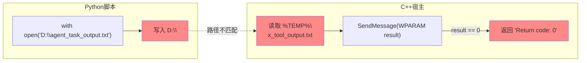
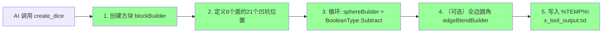
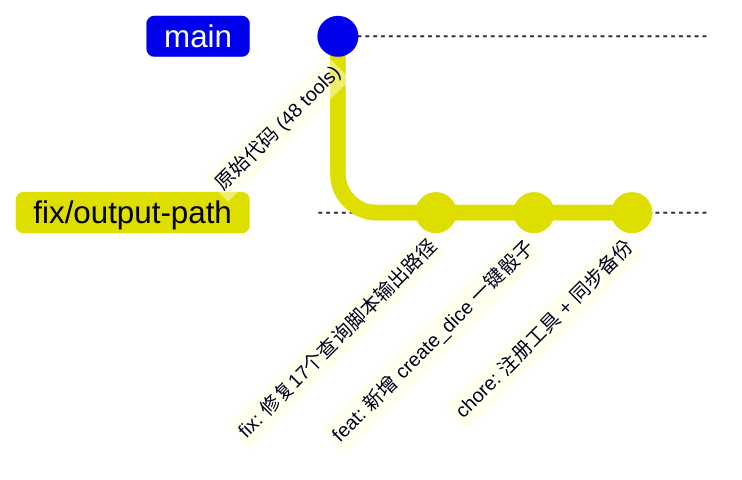

# NX 二次开发 AI 智能体调试报告

## 骰子 3D 建模失败分析与修复

**项目：** CustomResourceBarTab — NX2306 二次开发  
**日期：** 2026-07-19

---

## 1. 问题概述

在 NX2306 的 CustomResourceBarTab 插件中，通过 AI 智能体（LLM Agent）下发"生成一个骰子"指令时，AI 采取了多步分解策略：

1. **创建方块** → `create_block` ✅
2. **查询 body 信息** → `get_body_info` ❌
3. **布尔运算做凹坑** → `boolean_operation` ❌

所有查询工具全部返回 `"Tool execution failed (Return code: 0)"`，导致后续所有依赖 `body_tag` 的操作失败，AI 陷入死循环。

```mermaid
flowchart LR
    A["用户指令: 生成骰子"] --> B["步骤1: create_block ✅"]
    B --> C["步骤2: get_body_info ❌"]
    C --> D["无法获取 body_tag"]
    D --> E["步骤3: 猜 body_tag='1' ❌"]
    E --> F["步骤4: boolean_operation ❌"]
    F --> G["步骤5: create_cylinder 创建21个圆柱体"]
    G --> H["步骤6: subtraction_operation ❌"]
    H --> I["死循环: 尝试各种工具均失败"]
    style C fill:#f88
    style D fill:#f88
    style E fill:#f88
    style F fill:#f88
    style H fill:#f88
    style I fill:#f88
```



## 2. 运行环境

| 项目 | 内容 |
|------|------|
| CAD 平台 | Siemens NX2306 |
| 开发语言 | C++ (插件宿主) + Python (MCP 工具脚本) |
| 插件名称 | CustomResourceBarTab (WebView2 + LLM Agent) |
| MCP 工具脚本路径 | `程序包\startup\scripts\` |
| 工具注册文件 | `程序包\startup\scripts\available_tools.json` |
| Python 脚本数 | 48 个 MCP 工具 |
| LLM | 通义千问 (Qwen) |

## 3. 根因分析

### 3.1 输出文件路径错位（核心故障）

**故障现象：** 17 个 Python 脚本执行后将结果写入 `D:\agent_task_output.txt`，但 C++ 宿主代码从 `%TEMP%\nx_tool_output.txt` 读取。两个路径完全不匹配。

Python 脚本中的错误写法：

```python
# 错误写法（17个脚本都存在此问题）
with open("D:\\agent_task_output.txt", "w", encoding="utf-8") as f:
    f.write(output)
```

C++ 宿主代码的读取路径：

```cpp
// CustomResourceBarTab.cpp 第2505/2658行
std::string outputFile = std::string(tempDirBuf2) + "nx_tool_output.txt";
// 即 %TEMP%\nx_tool_output.txt
```



**致命后果：**

- Python 脚本写 `D:\agent_task_output.txt`
- C++ 代码读 `%TEMP%\nx_tool_output.txt`
- **两个路径完全不匹配**，C++ 永远读不到脚本的输出
- 如果 `D:\` 盘不存在或不可写，Python 的 `open()` 抛出异常，`Session::ExecuteWithStringArguments` 抛出 NXException
- C++ 的 `WM_EXECUTE_PYTHON` 处理器捕获异常 → `return 0`
- AI 收到 "Return code: 0"，认为工具执行失败

### 3.2 连锁故障链路

查询工具的失效导致了整个链路的崩溃：

1. `create_block` ✅ — 脚本无文件输出，正常执行
2. `get_body_info` ❌ — 无法获取 body_tag
3. `get_face_info` ❌ — 无法获取面的信息
4. `get_body_geometry` ❌ — 无法获取几何信息
5. `find_bodies_by_attribute` ❌ — 无法按属性查找
6. AI 无法获取任何 body_tag → 后续所有需要 body_tag 的操作全部失败
7. AI 陷入死循环，不断尝试各种工具组合

### 3.3 人工操作过程

部分脚本使用 NX 交互选择对话框，在 AI Agent 模式下无用户点击交互，导致失败：

| 脚本 | 问题 |
|------|------|
| `subtraction_operation.py` | 使用 SelectTaggedObjectWithFilterMembers 要求用户点击选择目标体和工具体 |
| `features_color.py` | 使用 Curves_select() 要求用户选择特征 |
| `set_material.py` | 使用 obj_select() 要求用户选择实体 |
| `create_hole.py` | 使用 SelectTaggedObjectWithFilterMembers 选择面 |

## 4. 解决方案

### 4.1 修复输出路径（基础设施修复）

将 17 个脚本的输出文件路径统一为系统临时目录，与 C++ 读取路径一致：

```python
# 修复前
with open("D:\\agent_task_output.txt", "w", encoding="utf-8") as f:
    f.write(output)

# 修复后
import os
_out = os.environ.get("TEMP", "C:\\temp") + "\\nx_tool_output.txt"
with open(_out, "w", encoding="utf-8") as f:
    f.write(output)
```

**修复文件列表（17个）：**

| 文件 | 功能 |
|------|------|
| `get_body_info.py` | 查询 body 信息 |
| `get_face_info.py` | 查询面信息 |
| `get_body_geometry.py` | 查询几何信息 |
| `get_edge_info.py` | 查询边信息 |
| `find_bodies_by_attribute.py` | 按属性查找 body |
| `set_body_attribute.py` | 设置 body 属性 |
| `boolean_operation.py` | 布尔并集 |
| `create_drill_hole.py` | 钻孔特征 |
| `edge_fillet.py` | 边圆角 |
| `set_body_color.py` | 设置 body 颜色 |
| `set_body_layer.py` | 设置层 |
| `set_body_translucency.py` | 设置透明度 |
| `set_face_color.py` | 设置面颜色 |
| `measure_body_clearance.py` | 测量间隙 |
| `find_faces_by_attribute_on_bodies.py` | 按属性查找面 |
| `check_face_body_interference_along_z.py` | Z 向干涉检查 |
| `plan_cooling_channels.py` | 冷却水路规划 |

### 4.2 新增一键骰子工具 create_dice（推荐方案）

除了修复基础设施，额外创建了一个**一次性完成骰子建模**的专用脚本，避免 AI 走多步分解的老路。



**设计要点：**

- 使用 `BlockFeatureBuilder` 创建立方体
- 使用 `CreateSphereBuilder` + `BooleanType.Subtract` 在每个面上创建球形凹坑
- 标准骰子布局：1↔6, 2↔5, 3↔4
- 凹坑位置使用 `block_size/4` 作为边距，自适应缩放
- body_tag 持久化：存储 Tag 后每次操作前通过 `workPart.Bodies` 重新查找，避免布尔运算后引用失效
- 可选边圆角：`CreateEdgeBlendBuilder` + `RuleEdgeDumb`

**工具参数：**

| 参数 | 类型 | 默认值 | 说明 |
|------|------|--------|------|
| `block_size` | float | 20.0 | 立方体边长 (mm) |
| `dot_diameter` | float | 3.0 | 凹坑直径 (mm) |
| `dot_depth` | float | 1.0 | 凹坑深度 (mm) |
| `edge_radius` | float | 0.5 | 边圆角半径 (mm)，0=锐边 |

## 5. 修改文件汇总

**总计：** 17 个文件修改 + 1 个文件新增 + 1 个配置文件修改 + 同步备份目录

| 操作 | 文件数 | 路径 |
|------|--------|------|
| 修改（修复输出路径） | 17 个 .py | `程序包\startup\scripts\*.py` |
| 新增（骰子一键工具） | 1 个 .py | `程序包\startup\scripts\create_dice.py` |
| 修改（注册工具） | 1 个 .json | `程序包\startup\scripts\available_tools.json` |
| 同步（备份目录） | 18 个 | `程序包\startup_hjq_20260319\startup\scripts\` |



## 6. 验证方法

1. **重启 NX**，让插件重新加载 `available_tools.json`
2. 在 AI 面板输入：`生成一个骰子，边长20mm，凹坑直径3mm，深度1mm，边圆角0.5mm`
3. **预期行为：**
   - AI 直接调用 `create_dice` 工具（不再走多步分解）
   - 一次执行完成整个骰子建模
   - 返回 "Dice created successfully"
4. **验证旧链路：**
   - 先执行 `get_body_info`，应正常返回 body 信息（不再返回 0）
   - 然后可正常使用 `create_drill_hole`、`boolean_operation` 等工具

## 7. 结论

本次调试解决了 NX AI Agent 中查询工具集体返回 `"Return code: 0"` 的根因问题。问题本质是 **Python 脚本输出路径与 C++ 读取路径不一致**导致的文件 I/O 失效。修复后查询工具可以正常返回数据，AI 的多步分解策略可以正常运行。同时新增了 `create_dice` 一键建模工具，提供更可靠的单步解决方案。

---

*报告生成时间: 2026-07-19*  
*项目: CustomResourceBarTab - NX2306 二次开发*
